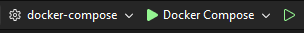

# Backend Hello
This API allows to interface the database and handles business functions

## Installation
Different ways can be used to spin up a backend Hello API.

### Creating the DataBase

The Docker Compose will create a local instance. If you already have a PostgreSQL instance running on your machine, make sure to deactivate it before booting up the Compose, as it will claim the same port.

### Installation introduction

There are multiple ways you can install the API:
- Using the docker compose file:  [Docker Compose](#-docker-compose)
  - Depending on the running parameter you can modify the existing code.
- Using a docker image:  [Docker Installation](#-docker-installation) (Deprecated)
  - This method doesn't allows you to modify easily the existing code and is more suited for a local server when there is only front-end development to be done.
- Using Compose with Visual Studio: [Integrated Compose with Visual Studio](#-compose-with-visual-studio)

### 🐳 Docker Compose
After cloning this repository, open it via a terminal or an IDE.  
```bash
cd path/to/repo
# With an SSH Key
git clone git@github.com:ApplETS/Backend-Hello.git
# Without an ssh key
git clone https://github.com/ApplETS/Backend-Hello.git
```
You'll need to setup the environment variables in the `.env` file.  
Simply copy and paste the `.env.template` file, rename it to `.env` and fill it with the correct values.  

Or, in the same directory as this README, run this command and fill it with the correct values:
```bash
cp core/.env.template .env
```
In the same directory as this README, run this the docker compose command:
```bash
docker compose up -d 
```

After running the docker compose file, the api should be accessible via:   
```bash
# API 
http://localhost:8081/api
# SWAGGER 
http://localhost:8081/swagger/index.html
```
> ⚠️ Don't forget to rebuild the app after modifying the source code, use the command docker compose up -d --build

### 🐳 Docker Installation
Start by pulling the image from docker hub
```bash
docker pull ghcr.io/applets/backend-hello:<VERSION>
```
multiple versions are available, you can check them [here](https://github.com/ApplETS/Backend-Hello/pkgs/container/backend-hello/versions)

The default one is `latest` but for cutting edge updates you can use `main` branch name.

#### Running the docker image
You'll need to setup the environment variables in the `.env` file

Simply copy and paste the `.env.template` file, rename it to `.env` and fill it with the correct value.

Then, run the image on your local machine
```bash
docker compose --env-file ./core/.env up -d
```

You can navigate to `http://localhost:8081/swagger` to check if the API is running correctly!

### 👷 Compose with Visual Studio
You will need a couple of things to get started developing and maintaining Hello-Backend.
- [WSL2](https://learn.microsoft.com/en-us/windows/wsl/install). Should be installed with Docker.
- Docker (suppose to be already installed at this point)
- [Git](https://git-scm.com/downloads)
- Visual Studio 2022 or above version. (Visual Studio 2026 does not include .NET 8 by default)
  - Make sure to check the ASP.NET and web development component


- .NET 8 (Does come with VS2022, but not VS2026)

NB: Compose is guaranteed to work with a Visual Studio 2026 instance. VS2022 might not work as straightforward.

#### Setup
1. Open Bash, navigate to somewhere you like:
```bash
cd path/to/repo
```
2. Clone the repo using an [ssh key](https://docs.github.com/en/authentication/connecting-to-github-with-ssh/generating-a-new-ssh-key-and-adding-it-to-the-ssh-agent) or by HTTPS:
```bash
# With an SSH Key
git clone git@github.com:ApplETS/Backend-Hello.git
# With HTTPS
git clone https://github.com/ApplETS/Backend-Hello.git
```
3. Open the .sln in Visual Studio 2022
4. You'll now need to create your `.env` file from the `.env.template`. You can ask help to fill the empty values from a project maintainer.


#### Running the app using Visual Studio
To run the app, make sure to select the docker-compose startup project: 

Then click on  to run the API.

You can navigate to http://localhost:8081/swagger where the app is running.
